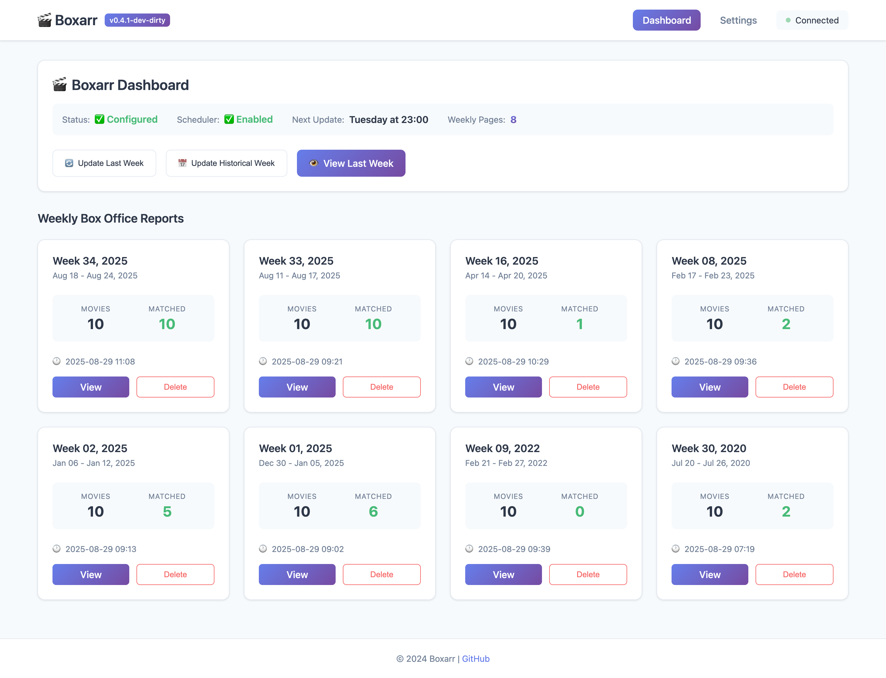
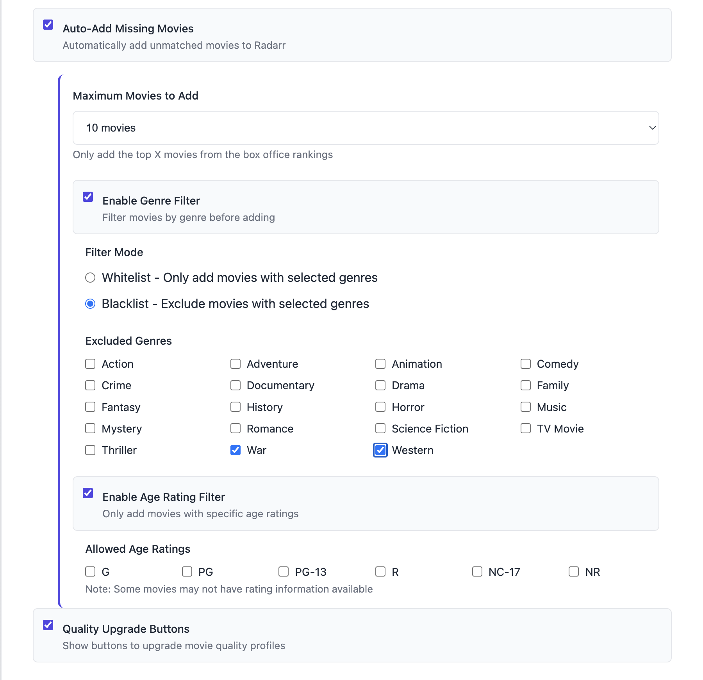

# Boxarr - Box Office Tracking for Radarr

[](https://www.gnu.org/licenses/gpl-3.0)
[](https://www.python.org/downloads/)
[](https://www.docker.com/)

## Why Boxarr?

> *"I run a Jellyfin server for my extended family and kept getting complaints about missing mainstream movies. I set up a request system to let them request movies, but they don't bother - they just complain. While I have Radarr, manually searching for trending movies is time-consuming. So I created Boxarr, which automatically fetches all the mainstream box office hits. I configure it to grab movies in 1080p to save space, then upgrade the ones I personally want to watch to UHD directly from the Boxarr UI. It runs automatically every Tuesday at 11 PM, ensuring my library always has what people actually want to watch."*

**Boxarr solves the problem of keeping your media library current with popular movies without manual intervention.** It automatically tracks what's trending at the box office and ensures your Radarr library has the movies people actually want to watch.

## Requirements

**Boxarr requires a working Radarr installation.** It's designed as a companion tool that extends Radarr's functionality by automatically adding trending movies from the box office.

### Prerequisites
- **Radarr** v3.0+ installed and configured
- **Docker** (recommended) or Python 3.10+
- Network access to Box Office Mojo for data fetching

## What is Boxarr?

Boxarr monitors the weekly box office top 10 and integrates with your Radarr instance to automatically add trending movies to your collection. It provides a beautiful web interface to view current and historical box office data while managing your movie library.

### Key Features

- **📊 Weekly Box Office Tracking** - Automatically fetches top 10 movies from Box Office Mojo
- **🔄 Radarr Integration** - Seamlessly checks and adds movies to your library
- **🎯 Smart Matching** - Intelligently matches box office titles with Radarr entries
- **⚡ Auto-Add Movies** - Optionally adds missing movies automatically with advanced filtering:
  - Limit to top X movies (1-10)
  - Filter by genre (whitelist/blacklist)
  - Filter by age rating (G, PG, PG-13, R, etc.)
- **📅 Scheduled Updates** - Runs weekly on your preferred schedule
- **🎨 Beautiful Web UI** - Clean, responsive interface for all devices
- **🚀 Easy Setup** - No configuration files needed - just a simple web wizard

## Quick Start

### Using Docker (Recommended)

```bash
docker run -d \
  --name boxarr \
  -p 8888:8888 \
  -v /path/to/config:/config \
  ghcr.io/iongpt/boxarr:latest
```

Visit `http://localhost:8888` and follow the setup wizard.

### Docker Compose

```yaml
version: '3.8'

services:
  boxarr:
    image: ghcr.io/iongpt/boxarr:latest
    container_name: boxarr
    ports:
      - 8888:8888
    volumes:
      - ./config:/config
    restart: unless-stopped
    environment:
      - TZ=America/New_York  # Optional: Set your timezone
```

### Manual Installation

```bash
# Clone the repository
git clone https://github.com/iongpt/boxarr.git
cd boxarr

# Install dependencies
pip install -r requirements.txt

# Run the application
python -m src.main
```

## First-Time Setup

1. **Open your browser** to `http://localhost:8888`
2. **Enter Radarr details** in the setup wizard:
   - Radarr URL (e.g., `http://localhost:7878`)
   - API Key (found in Radarr → Settings → General → Security)
3. **Test the connection** to fetch quality profiles
4. **Configure your preferences**:
   - Default quality profile for new movies (e.g., HD-1080p to save space)
   - Ultra-HD upgrade profile for selective upgrades
   - Auto-add movies toggle
   - Update schedule (e.g., Tuesday at 11 PM)
5. **Save and start tracking!**

## Using Boxarr

### Dashboard
The main dashboard shows all tracked weeks with the ability to:
- Browse historical box office data
- Delete old weeks to save space
- Navigate quickly to recent weeks
- Access settings and configuration

### Weekly View
Each week displays:
- Movie posters with box office rankings
- Current Radarr status (Downloaded, Missing, In Cinemas)
- Box office earnings and theater counts
- Quick actions to add movies or upgrade quality

### Settings
All configuration can be managed through the web interface:
- Update Radarr connection details
- Change quality profiles
- Toggle auto-add functionality
- Modify update schedule
- Test connections

## Configuration Options

### Scheduling
By default, Boxarr updates every Tuesday at 11 PM. You can customize this in Settings.

### Quality Profiles
Select from your existing Radarr quality profiles:
- **Default Profile**: Used when adding new movies (e.g., HD-1080p to save storage)
- **Upgrade Profile**: Available for one-click quality upgrades (e.g., Ultra-HD for favorites)

### Auto-Add Movies
When enabled, Boxarr will automatically:
1. Search for unmatched movies in TMDB
2. Apply configured filters (genre, rating, top X limit)
3. Add filtered movies to Radarr with your default profile
4. Mark them as monitored and trigger automatic search

#### Advanced Filtering Options
- **Top X Limit**: Add only the highest-ranking movies (1-10)
- **Genre Filtering**: 
  - Whitelist: Only add movies with selected genres
  - Blacklist: Exclude movies with selected genres
- **Age Rating Filter**: Control content by MPAA ratings (G, PG, PG-13, R, NC-17, NR)

## Reverse Proxy Configuration

Boxarr supports running behind a reverse proxy at a custom path (e.g., `/boxarr` instead of `/`). This is useful when you want to access multiple services through a single domain.

### Setting the URL Base

The URL base is configured via the `BOXARR_URL_BASE` environment variable. **Do not include leading or trailing slashes.**

#### Docker Compose Example

```yaml
version: '3.8'

services:
  boxarr:
    image: ghcr.io/iongpt/boxarr:latest
    container_name: boxarr
    ports:
      - 8888:8888
    volumes:
      - ./config:/config
    environment:
      - TZ=America/New_York
      - BOXARR_URL_BASE=boxarr  # Access at http://your-server/boxarr/
    restart: unless-stopped
```

#### Command Line Example

```bash
BOXARR_URL_BASE=boxarr python -m src.main
```

### Nginx Configuration

```nginx
location /boxarr/ {
    proxy_pass http://localhost:8888/;
    proxy_set_header Host $host;
    proxy_set_header X-Real-IP $remote_addr;
    proxy_set_header X-Forwarded-For $proxy_add_x_forwarded_for;
    proxy_set_header X-Forwarded-Proto $scheme;
    proxy_set_header X-Forwarded-Prefix /boxarr;
    
    # WebSocket support (for real-time updates)
    proxy_http_version 1.1;
    proxy_set_header Upgrade $http_upgrade;
    proxy_set_header Connection "upgrade";
}
```

### Traefik Configuration

```yaml
# Docker labels for Traefik
labels:
  - "traefik.enable=true"
  - "traefik.http.routers.boxarr.rule=Host(`your-domain.com`) && PathPrefix(`/boxarr`)"
  - "traefik.http.routers.boxarr.middlewares=boxarr-stripprefix"
  - "traefik.http.middlewares.boxarr-stripprefix.stripprefix.prefixes=/boxarr"
  - "traefik.http.services.boxarr.loadbalancer.server.port=8888"
```

### Caddy Configuration

```caddy
your-domain.com {
    handle_path /boxarr* {
        reverse_proxy localhost:8888
    }
}
```

### Important Notes

1. **Configuration is read-only in UI**: For safety, the URL base can only be set via environment variable, not through the web interface. This prevents accidental lockouts.

2. **Restart required**: After setting or changing `BOXARR_URL_BASE`, you must restart Boxarr for the changes to take effect.

3. **Accessing the application**: 
   - Without URL base: `http://your-server:8888/`
   - With URL base "boxarr": `http://your-server:8888/boxarr/`
   - Behind reverse proxy: `https://your-domain.com/boxarr/`

4. **Recovery**: If you're locked out due to incorrect configuration:
   ```bash
   # Reset to root path
   BOXARR_URL_BASE="" python -m src.main
   
   # Or edit your docker-compose.yml and remove the BOXARR_URL_BASE line
   ```

## API Endpoints

Boxarr provides a REST API for integration:

- **API Documentation**: `http://localhost:8888/api/docs`
- **Current Box Office**: `GET /api/boxoffice/current`
- **Add Movie**: `POST /api/movies/add`
- **Trigger Update**: `POST /api/trigger-update`

## Screenshots

### Dashboard View


Track all your weekly box office reports in one place. See at a glance which movies are matched with your Radarr library and when the next automatic update will run.

### Weekly Box Office View


Beautiful movie cards showing current box office rankings, download status, quality profiles, and quick action buttons. Upgrade quality or add missing movies with a single click.

### Advanced Auto-Add Filters


Fine-tune which movies are automatically added with powerful filtering options:
- **Top X Limit**: Only add the highest-ranking movies (1-10)
- **Genre Filtering**: Whitelist or blacklist specific genres
- **Age Rating Filter**: Control content by MPAA ratings

## Troubleshooting

### Cannot Connect to Radarr
- Verify Radarr is running and accessible
- Check the API key is correct
- Ensure Boxarr can reach Radarr's network

### Movies Not Matching
- Movie titles may differ between Box Office Mojo and Radarr
- Check the logs at `/config/logs/boxarr.log`
- Use the "Add to Radarr" button for manual addition

### Scheduler Not Running
- Verify scheduler is enabled in Settings
- Check timezone configuration
- Review logs for any scheduler errors

### Web Interface Not Loading
- Ensure port 8888 is not in use
- Check Docker container is running: `docker ps`
- View logs: `docker logs boxarr`

## Support

- **Issues**: [GitHub Issues](https://github.com/iongpt/boxarr/issues)
- **Discussions**: [GitHub Discussions](https://github.com/iongpt/boxarr/discussions)
- **Wiki**: [Documentation Wiki](https://github.com/iongpt/boxarr/wiki)

## Contributing

We welcome contributions! Please see [CONTRIBUTING.md](CONTRIBUTING.md) for guidelines.

## License

GNU General Public License v3.0 - see [LICENSE](LICENSE) for details.

## Acknowledgments

- [Radarr](https://radarr.video/) for the excellent movie management platform
- [Box Office Mojo](https://www.boxofficemojo.com/) for box office data
- The self-hosting community for inspiration and feedback

## Disclaimer

This project is not affiliated with Box Office Mojo, IMDb, or Radarr. It's an independent tool created for personal media management.

---

Made with ❤️ for the self-hosting community