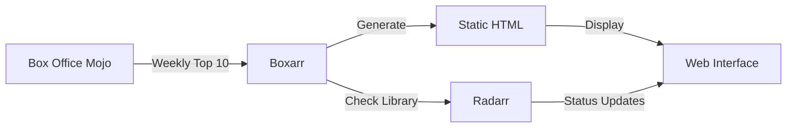

# Boxarr - Box Office Tracking for Radarr

[](https://www.gnu.org/licenses/gpl-3.0)
[](https://www.python.org/downloads/)
[](https://www.docker.com/)

Boxarr is a companion application for Radarr that tracks weekly box office performance and automatically adds trending movies to your collection.

## What It Does

Boxarr connects to Box Office Mojo to fetch the top 10 movies each week, checks if they're in your Radarr library, and can automatically add missing titles. Perfect for keeping your movie collection current with what's popular in theaters.

### Key Features

- **📊 Weekly Box Office Tracking** - Fetches top 10 movies from Box Office Mojo
- **🔄 Radarr Integration** - Checks which movies you already have
- **➕ Auto-Add Movies** - Optionally adds missing movies to Radarr
- **📅 Scheduled Updates** - Runs weekly on your schedule
- **🎨 Beautiful Web Interface** - Clean, responsive design for viewing results
- **🏠 Local First** - Designed for home networks, no cloud dependencies

## Quick Start

### Using Docker (Recommended)

```bash
docker run -d \
  --name boxarr \
  -p 8888:8888 \
  -v /path/to/config:/config \
  ghcr.io/iongpt/boxarr:latest
```

Visit `http://localhost:8888` to complete the setup wizard.

### Manual Installation

```bash
# Clone the repository
git clone https://github.com/iongpt/boxarr.git
cd boxarr

# Install dependencies
pip install -r requirements.txt

# Run the application
python -m src.main
```

## Configuration

No configuration files needed! On first run, visit the web interface at `http://localhost:8888` and you'll be guided through:

1. **Radarr Connection** - Enter your Radarr URL and API key
2. **Quality Settings** - Choose default quality profiles
3. **Automation** - Enable/disable auto-add and scheduling

All settings can be changed later through the web interface.

## How It Works



1. **Data Collection**: Fetches current box office rankings every week
2. **Library Matching**: Intelligently matches movies with your Radarr library
3. **Auto-Management**: Optionally adds missing movies with your preferred quality
4. **Static Generation**: Creates fast, efficient HTML pages for each week
5. **Dynamic Updates**: JavaScript polls for Radarr status changes

## Web Interface

### Dashboard
View all tracked weeks at a glance, with quick access to recent data and historical trends.

### Weekly Pages
Each week gets its own page showing:
- Movie rankings and box office earnings
- Poster artwork and descriptions
- Radarr status (Downloaded, Missing, In Cinemas)
- Quick actions (Add to Radarr, Upgrade Quality)

### Settings
Configure all aspects of Boxarr without editing files:
- Radarr connection details
- Quality profiles
- Scheduling options
- Auto-add preferences

## Architecture

Boxarr is built with simplicity and efficiency in mind:

- **FastAPI** backend for speed and modern Python features
- **Static HTML generation** for fast page loads
- **Minimal JavaScript** for dynamic status updates
- **No external dependencies** beyond Radarr

## Docker Deployment

### Docker Compose

```yaml
version: '3.8'

services:
  boxarr:
    image: ghcr.io/iongpt/boxarr:latest
    container_name: boxarr
    ports:
      - 8888:8888
    volumes:
      - ./config:/config
    restart: unless-stopped
    environment:
      - TZ=America/New_York  # Optional: Set your timezone
```

### Building from Source

```bash
docker build -t boxarr .
docker run -d -p 8888:8888 -v ./config:/config boxarr
```

## API Documentation

Boxarr provides a REST API for integration:

- **API Docs**: `http://localhost:8888/api/docs`
- **OpenAPI Schema**: `http://localhost:8888/api/openapi.json`

### Key Endpoints

- `GET /api/boxoffice/current` - Current week's box office
- `GET /api/movies/{id}` - Movie details
- `POST /api/movies/add` - Add movie to Radarr
- `POST /api/scheduler/trigger` - Manual update trigger

## Development

### Prerequisites

- Python 3.10+
- Node.js 16+ (for frontend development)

### Setup Development Environment

```bash
# Clone repository
git clone https://github.com/iongpt/boxarr.git
cd boxarr

# Create virtual environment
python -m venv venv
source venv/bin/activate  # On Windows: venv\Scripts\activate

# Install dependencies
pip install -r requirements.txt
pip install -e ".[dev]"

# Run tests
pytest tests/

# Run with hot reload
python -m src.main --reload
```

### Running Tests

```bash
# Unit tests
pytest tests/unit/

# Integration tests
pytest tests/integration/

# Coverage report
pytest --cov=src tests/
```

## Troubleshooting

### Common Issues

**Can't connect to Radarr**
- Verify Radarr is running and accessible
- Check API key is correct
- Ensure network connectivity between Boxarr and Radarr

**Movies not being matched**
- Check movie titles in Radarr match Box Office Mojo listings
- Review matching confidence in logs
- Titles with special characters may need manual matching

**Scheduler not running**
- Verify scheduler is enabled in settings
- Check system time and timezone settings
- Review logs for scheduler errors

### Getting Help

- **Issues**: [GitHub Issues](https://github.com/iongpt/boxarr/issues)
- **Discussions**: [GitHub Discussions](https://github.com/iongpt/boxarr/discussions)
- **Wiki**: [Documentation Wiki](https://github.com/iongpt/boxarr/wiki)

## Contributing

Contributions are welcome! Please read our [Contributing Guide](CONTRIBUTING.md) for details on:

- Code of Conduct
- Development process
- How to submit pull requests
- Coding standards

## License

This project is licensed under the GNU General Public License v3.0 - see the [LICENSE](LICENSE) file for details.

## Acknowledgments

- [Radarr](https://radarr.video/) for the excellent movie management platform
- [Box Office Mojo](https://www.boxofficemojo.com/) for box office data
- The home media server community for inspiration

## Disclaimer

This project is not affiliated with Box Office Mojo, IMDb, or Radarr. It's an independent tool created for personal media management in home networks.

---

Made with ❤️ for the self-hosting community