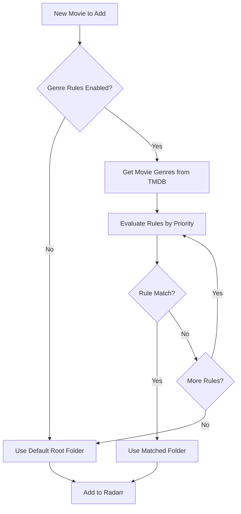

# Genre-Based Root Folders

Organize your movie library intelligently by automatically placing movies into different folders based on their genres.

## 🎯 Overview

Genre-Based Root Folders allow you to:
- **Separate content** by type (Horror, Family, Documentary)
- **Manage storage** across different drives
- **Control access** to specific content
- **Organize libraries** for multiple users


## 🚀 Quick Setup

### Enable the Feature

1. Navigate to **Settings → Advanced**
2. Toggle **"Enable Genre-Based Root Folders"**
3. Configure your rules
4. Save settings


## 📝 Configuration

### Web Interface Setup

Access the configuration at **Settings → Advanced → Genre-Based Root Folders**:


### Adding Rules

Click **"Add Rule"** and configure:

| Field | Description | Example |
|-------|-------------|---------|
| **Genres** | One or more genres (comma-separated) | `Horror, Thriller` |
| **Root Folder** | Destination path | `/movies/scary` |
| **Priority** | Order of evaluation (0 = highest) | `0` |

### YAML Configuration

For advanced users, edit `/config/root-folders.yaml`:

```yaml
# Enable/disable the feature
enabled: true

# Define your rules (evaluated top to bottom)
rules:
  # Scary movies go to a separate location
  - genres: ["Horror", "Thriller"]
    path: "/movies/scary"
    priority: 0
    
  # Family-friendly content
  - genres: ["Animation", "Family", "Kids"]
    path: "/movies/family"
    priority: 1
    
  # Educational content
  - genres: ["Documentary", "Biography"]
    path: "/movies/educational"
    priority: 2
    
  # Action-packed movies
  - genres: ["Action", "Adventure", "Sci-Fi", "Fantasy"]
    path: "/movies/action"
    priority: 3
    
  # Romantic movies
  - genres: ["Romance", "Drama"]
    path: "/movies/drama"
    priority: 4
    
  # Comedy
  - genres: ["Comedy"]
    path: "/movies/comedy"
    priority: 5

# Fallback when no rules match
default_path: "/movies/general"

# Additional options
options:
  case_sensitive: false
  log_decisions: true
  strict_matching: false
```

## 🎭 Genre Mappings

### Common Movie Genres

Here are the standard TMDB genres you can use:

| Genre | Description | Typical Movies |
|-------|-------------|----------------|
| **Action** | High energy, stunts | Marvel, Fast & Furious |
| **Adventure** | Exploration, quests | Indiana Jones, Jumanji |
| **Animation** | Animated features | Pixar, Disney, Anime |
| **Comedy** | Humor-focused | Comedies, Rom-coms |
| **Crime** | Criminal activities | Heist films, Noir |
| **Documentary** | Non-fiction | Nature, True crime |
| **Drama** | Serious themes | Oscar winners |
| **Family** | All-ages content | Disney, Dreamworks |
| **Fantasy** | Magical elements | Harry Potter, LOTR |
| **History** | Historical events | Period pieces |
| **Horror** | Scary content | Halloween, The Conjuring |
| **Music** | Musical focus | Musicals, Concerts |
| **Mystery** | Puzzles, whodunits | Detective stories |
| **Romance** | Love stories | Rom-coms, Dramas |
| **Science Fiction** | Futuristic/tech | Star Wars, Star Trek |
| **TV Movie** | Made for TV | TV specials |
| **Thriller** | Suspenseful | Psychological thrillers |
| **War** | Military conflicts | War films |
| **Western** | Old West setting | Cowboys |

## 🔄 How It Works

### Rule Evaluation Process



### Priority System

Rules are evaluated in order of priority (0 = highest):


**Example Movie:** "The Conjuring" with genres [Horror, Thriller, Mystery]

```yaml
rules:
  - genres: ["Mystery"]      # Priority 0 - Skipped
    path: "/movies/mystery"
    
  - genres: ["Horror"]        # Priority 1 - MATCHED! ✓
    path: "/movies/horror"
    
  - genres: ["Thriller"]      # Priority 2 - Not evaluated
    path: "/movies/thriller"
```

**Result:** Movie goes to `/movies/horror`

## 📋 Use Cases

### Family Media Server

Separate adult content from family-friendly:

```yaml
rules:
  # Kids can access this
  - genres: ["Animation", "Family", "Adventure"]
    path: "/media/kids"
    priority: 0
    
  # Teens section
  - genres: ["Action", "Comedy", "Romance"]
    path: "/media/teens"
    priority: 1
    
  # Adult content
  - genres: ["Horror", "Thriller", "Crime"]
    path: "/media/adults"
    priority: 2
```

### Multi-Drive Setup

Distribute across different storage devices:

```yaml
rules:
  # 4K content on SSD
  - genres: ["Action", "Sci-Fi", "Adventure"]
    path: "/ssd/movies"
    priority: 0
    
  # Large files on NAS
  - genres: ["Documentary", "Biography"]
    path: "/nas/documentaries"
    priority: 1
    
  # Everything else on HDD
default_path: "/hdd/movies"
```

### Language/Region Organization

Organize by content origin:

```yaml
rules:
  # Anime and Asian cinema
  - genres: ["Animation"]
    path: "/movies/anime"
    priority: 0
    
  # Bollywood
  - genres: ["Music", "Romance", "Drama"]
    path: "/movies/bollywood"
    priority: 1
    
  # European cinema
  - genres: ["Drama", "History"]
    path: "/movies/european"
    priority: 2
```

## ⚙️ Advanced Configuration

### Conditional Rules

Use multiple genres for precise matching:

```yaml
rules:
  # Only horror comedies
  - genres: ["Horror", "Comedy"]
    path: "/movies/horror-comedy"
    match_all: true  # Must have BOTH genres
    priority: 0
```

### Storage Balancing

Distribute based on expected file sizes:

```yaml
rules:
  # High-bitrate action movies
  - genres: ["Action", "Sci-Fi"]
    path: "/large-storage/movies"
    min_quality: "Remux-2160p"
    priority: 0
    
  # Smaller files
  - genres: ["Comedy", "Romance"]
    path: "/small-storage/movies"
    max_quality: "Bluray-1080p"
    priority: 1
```

### User-Specific Libraries

Different folders for different Plex/Jellyfin libraries:

```yaml
rules:
  # Mom's movies
  - genres: ["Romance", "Drama", "Comedy"]
    path: "/movies/mom"
    
  # Dad's movies  
  - genres: ["Action", "War", "Western"]
    path: "/movies/dad"
    
  # Kids' movies
  - genres: ["Animation", "Family"]
    path: "/movies/kids"
```

## 🔍 Monitoring and Logs

### Decision Logging

Enable detailed logging to see folder decisions:

```yaml
options:
  log_decisions: true
  log_level: "DEBUG"
```

View logs at `/config/logs/boxarr.log`:

```
INFO: Movie "Dune" matched rule #3 (Sci-Fi) → /movies/scifi
INFO: Movie "Frozen" matched rule #1 (Animation) → /movies/family
WARN: Movie "Unknown" no genre match → /movies/general (default)
```

### Statistics

View folder distribution in the dashboard:


## 🚨 Troubleshooting

### Common Issues

| Issue | Cause | Solution |
|-------|-------|----------|
| **Movies going to wrong folder** | Rule priority incorrect | Reorder rules, check priority |
| **Folder not found in Radarr** | Path doesn't exist | Add root folder to Radarr first |
| **No genre information** | TMDB lookup failed | Check internet, retry manual add |
| **All movies to default** | Rules not matching | Check genre spelling, enable logging |

### Validation

Test your configuration:

1. **Dry Run Mode**: Test without adding movies
2. **Check Logs**: Enable debug logging
3. **Manual Test**: Add one movie manually
4. **Verify Paths**: Ensure folders exist in Radarr

### Rule Testing

Use the test interface:


1. Enter movie genres
2. Click "Test Rules"
3. See which folder would be selected
4. Adjust rules as needed

## 🎯 Best Practices

### Organization Tips

1. **Start Simple**: Begin with 3-4 basic rules
2. **Use Priority Wisely**: Most specific rules first
3. **Plan Storage**: Consider drive space per genre
4. **Document Rules**: Comment your configuration
5. **Regular Review**: Adjust based on usage

### Performance Considerations

- **Rule Count**: Keep under 20 rules
- **Genre Lists**: Minimize genres per rule
- **Path Validation**: Cache folder checks
- **Logging**: Disable debug in production

### Maintenance

1. **Review Monthly**: Check folder distribution
2. **Clean Up**: Remove unused rules
3. **Update Paths**: When storage changes
4. **Backup Config**: Before major changes

## 📚 Examples

### Minimal Setup

Just separate kids content:

```yaml
enabled: true
rules:
  - genres: ["Animation", "Family"]
    path: "/movies/kids"
default_path: "/movies/general"
```

### Complex Setup

Full organization system:

```yaml
enabled: true
rules:
  # Premium content
  - genres: ["Action", "Sci-Fi"]
    path: "/nvme/movies-4k"
    quality_profile: "Ultra-HD"
    priority: 0
    
  # Restricted content
  - genres: ["Horror", "Thriller"]
    path: "/secure/adult-movies"
    min_age_rating: "R"
    priority: 1
    
  # Educational
  - genres: ["Documentary"]
    path: "/nas/educational"
    quality_profile: "HD-1080p"
    priority: 2
    
  # Kids
  - genres: ["Animation", "Family"]
    path: "/shared/kids"
    max_age_rating: "PG"
    priority: 3
    
  # Archive
  - genres: ["History", "Biography"]
    path: "/archive/historical"
    priority: 4

default_path: "/media/movies"

options:
  case_sensitive: false
  log_decisions: true
  validate_paths: true
  fallback_on_error: true
```

## 🔗 Related Features

- **[Auto-Add Movies](Auto-Add-Movies)**: Works with genre folders
- **[Quality Profiles](Quality-Profiles)**: Per-genre quality settings
- **[Advanced Filters](Advanced-Filters)**: Genre-based filtering
- **[API Reference](API-Reference)**: Programmatic folder management

## 🆘 Getting Help

- Check [FAQ](FAQ#genre-folders)
- Review [Troubleshooting](Troubleshooting#folders)
- Ask in [Discussions](https://github.com/iongpt/boxarr/discussions)
- Report [Issues](https://github.com/iongpt/boxarr/issues)

---

[← Auto-Add Movies](Auto-Add-Movies) | [Home](Home) | [Advanced Filters →](Advanced-Filters)